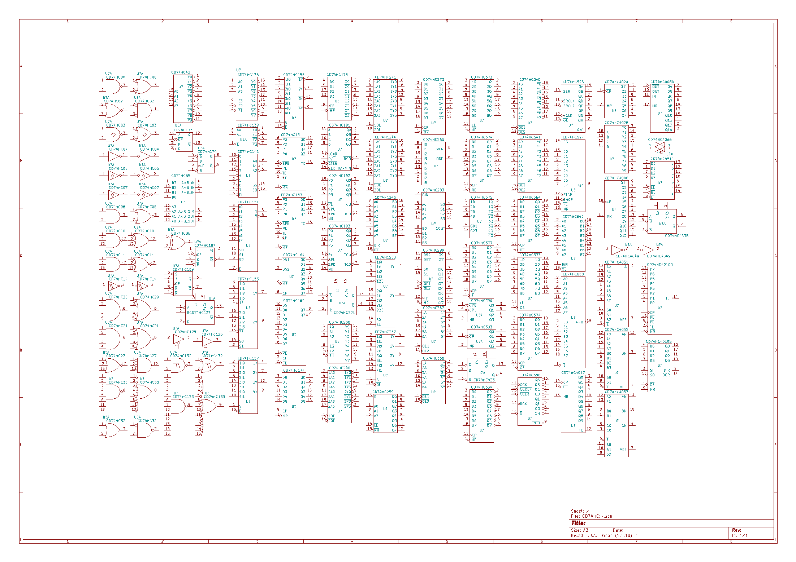
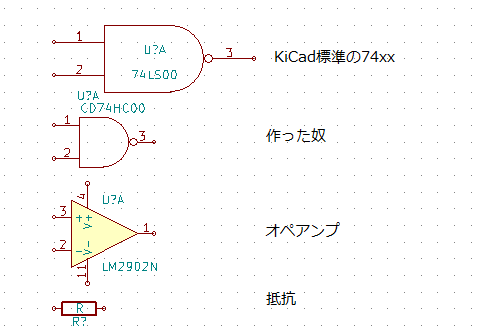
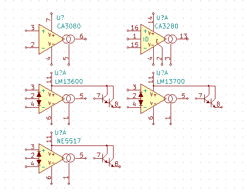
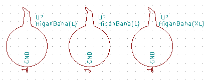

# kicad-lib

KiCad symbol libraries

### CD74HCxx.lib/dcm
small size TTL symbols　library  
スモールサイズTTLシンボルライブラリ  

　This library is created in order to take a balance between TTL and other parts (e.g. opamp), because the TTL symbols of KiCad standard library is a bit too large.

 このライブラリはKiCadの標準ライブラリのTTLのシンボルがオペアンプ等のシンボルに対して大きすぎるためバランスを取るために作ったものです。現在秋葉原の店で普通に入手可能なものだけ90種を詰め込んであります。

### ota.lib/dcm
OTA (Operational transconductance amplifier) symbols. These are important for analog synths.

アナログシンセ等で良く使用されるOTA (Operational transconductance amplifier) のライブラリです。

### Kyuukon.lib/dcm
Bulbs of amaryllis that is suddenly sold by japanese famouse electric parts store 'Akizuki'.

秋月電子で突然発売されて話題になった彼岸花の球根です。  

## License
  CC0 1.0 Universal
